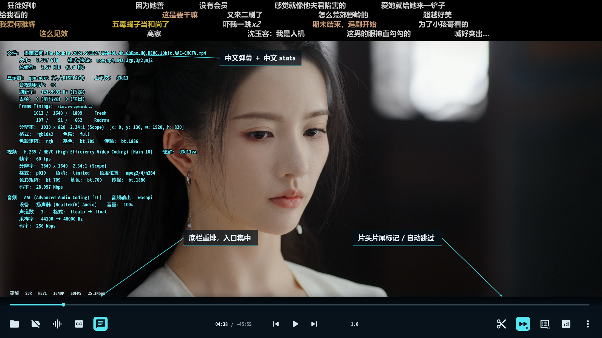
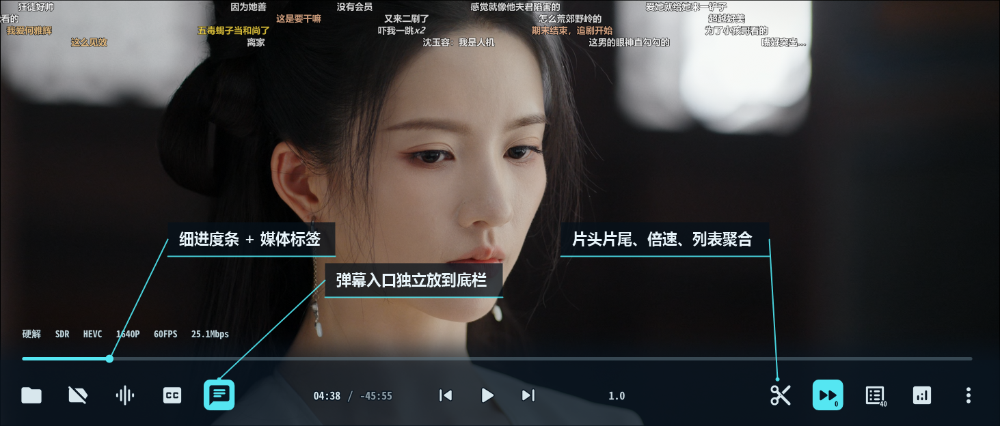
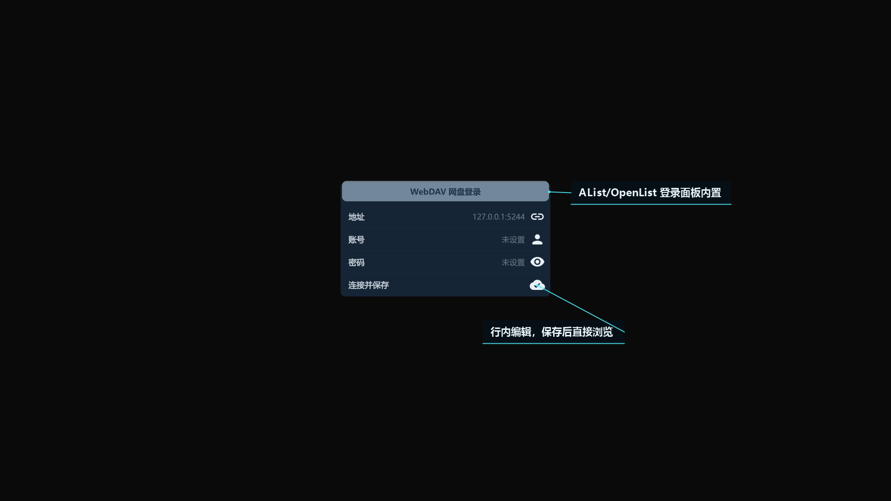

# Yaozhil MPV 整合包

面向 Windows mpv 的自制 UI 整合包<br>基于 [dyphire/mpv-config](https://github.com/dyphire/mpv-config) 的配置结构继续整理<br>并加入个人维护的 uosc 布局、快捷键菜单、弹幕、片头片尾标记、AList/OpenList 网盘入口和中文统计信息体验

所有发布版都已做通用化处理。

> 上游参考：<br>
>`dyphire/mpv-config` 是 Windows下mpv 配置项目<br>
>`yosh-wang/mpv-stats.lua-zh-chinese-translation-` 提供中文版 stats.lua 思路与同步说明<br>
>`yosh-wang/auto_bluray-ISO-`提供圆盘ISO思路并深度优化

## UI 预览



### 底栏细节



### 网盘登录面板




### 杳知配置助手3.0


## 安装

1. 下载整合包：[mpv-yaozhi-2026.06.30+.zip](https://github.com/Yaozhil/mpv-config/releases/download/%E6%9D%B3%E7%9F%A5mvp%E6%95%B4%E5%90%88%E5%8C%85/mpv-Yaozhi.2026.6.30+.zip)，解压即可使用<br>

2. 打开配置助手，按需配置即可（会自动获取显卡信息）<br>

    注：整合内已有 `杳知配置助手2.0`


- 配置助手教程：把`杳知配置助手2.0（MPV）.exe` 放到 mpv 根目录，与 `mpv.exe` 同级即可<br>

- 配置助手下载：[杳知配置助手2.0（MPV）.zip](https://github.com/user-attachments/files/29499009/2.0.MPV.zip)

## 主要特色

- uosc 中文界面与菜单体验优化。
- 常用 UI 操作、播放控制、文件管理、字幕、音轨和播放列表快捷键整理。
- 集成弹幕相关配置。
- 新增片头片尾跳过。
- 新增纯本地化自定义片头片尾设置工具（剪刀图标）。
- 新增 AList/OpenList 登录弹窗和网盘图标（AList 相关适配）。
- 新增本地 ISO 视频格式播放。
- 重写文件浏览器鼠标操作，支持鼠标悬停高亮提示。
- 中文化 stats，方便查看解码、HDR、帧耗时和音频状态。

详细说明见 [独特功能说明](docs/unique-features.md)。

## 目录说明

```text
portable_config/
├─ mpv.conf              # mpv 主配置，通用硬件默认值
├─ input.conf            # 快捷键与菜单预设
├─ scripts/README.md     # 脚本同步说明
├─ script-opts/          # 脚本选项示例
├─ shaders/README.md     # shader 同步说明
└─ fonts/README.md       # 字体说明，不附带字体文件
docs/
├─ unique-features.md    # 本维护版特色说明
├─ release-check.md      # 发布前检查
└─ images/               # UI 展示图
```

## 许可与来源说明

本仓库整理自个人使用配置，并参考以下项目结构或思路：

- [dyphire/mpv-config](https://github.com/dyphire/mpv-config)
- [yosh-wang/mpv-stats.lua-zh-chinese-translation-](https://github.com/yosh-wang/mpv-stats.lua-zh-chinese-translation-)
- [yosh-wang/auto_bluray-ISO-](https://github.com/yosh-wang/auto_bluray-ISO-)
- mpv 社区脚本与相关开源项目

各脚本、shader 与第三方组件的版权和许可归原作者所有。

若上游项目自带 LICENSE / README，本仓库会尽量保留原始说明。

## 免责声明

本配置主要面向 Windows mpv 用户。不同 mpv 构建、显卡驱动、系统版本和脚本依赖环境可能导致体验不同。

建议直接使用整合包，解压即用。

如遇问题，反馈即可。
