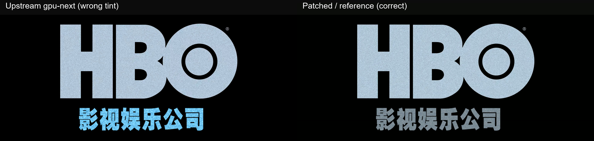

# HDR / Dolby Vision 图形字幕色彩空间问题

本目录保存提交给 `mpv-player/mpv` 上游 Issue 的最小复现材料。

## 问题

`vo=gpu-next` 当前会让 PGS、VobSub、DVB 等 `SUBBITMAP_BGRA`
图形字幕继承 HDR 视频的色彩空间，导致中性灰、黄色或橙色图形出现明显色偏。

## 已验证修复

核心补丁：

[`patches/0001-vo_gpu_next-add-image-subtitle-colorspace-control.patch`](../../../patches/0001-vo_gpu_next-add-image-subtitle-colorspace-control.patch)

补丁新增 `image-subs-colorspace=<video|sdr|auto>`。`auto` 仅在 HDR
源视频中将 BGRA 图形字幕按 SDR sRGB / 203 nit 参考白处理，不改变视频、
ASS/文本字幕、OSD、音频、硬件解码、着色器或所选 VO。

真实 HDR 设备 A/B 测试已确认图形字幕颜色恢复正常，同时视频颜色保持正确。

## 同帧对比

## 示例文件

- [`hdr10-pgs-synthetic-sample.mkv`](hdr10-pgs-synthetic-sample.mkv)：15.015 秒合成 HDR10/PQ + PGS 最小复现视频，无音频。
- [`comparison-upstream-vs-fixed.jpg`](comparison-upstream-vs-fixed.jpg)：上游错误色相与修复后正确色相的同帧对比。
- [`output-upstream.txt`](output-upstream.txt)：上游版本完整日志。
- [`output-patched.txt`](output-patched.txt)：修复验证版本完整日志。
- [`sample-ffprobe.json`](sample-ffprobe.json)：示例视频的完整 FFprobe 流与容器信息。
- [`0001-vo_gpu_next-add-image-subtitle-colorspace-control.patch`](0001-vo_gpu_next-add-image-subtitle-colorspace-control.patch)：已通过真实 HDR 设备 A/B 验证的定点核心补丁。

所有材料均以独立文件公开，不再提供 ZIP 打包文件。
